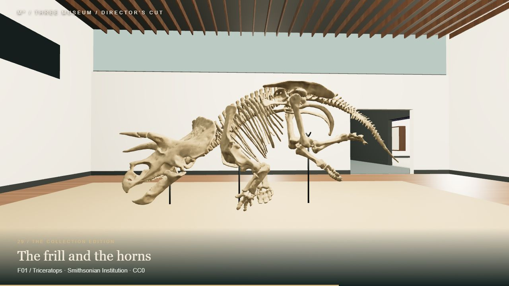

# ThreeMuseum

**Small worlds. Deep time.** A walkable natural-history museum built with Three.js and Blender MCP: 11 connected spaces, 30 installed exhibits, and an editable architectural world.

An independent design inspired by Melbourne Museum, not an official museum experience or an exact replica.

**[Explore the live museum →](https://samg-coder.github.io/ThreeMuseum/)**

[](https://samg-coder.github.io/ThreeMuseum/)

*In-browser view of the Last Giants gallery. Triceratops model: Smithsonian Institution, CC0.*

## Run locally

Requires Node.js 20 or newer.

```sh
npm ci
npm start
```

Open http://127.0.0.1:4173. Three.js is copied locally during installation; the museum and embedded GLBs then work offline. `START.bat` and `START.command` are launcher alternatives. Use an HTTP server, not `file://`.

## Explore

- **Thirty installations:** dinosaur and megafauna skeleton studies, insects, arachnids, habitats, fossils, botanical displays and learning stations.
- **Eleven connected spaces:** galleries, a light court, arrival hall, theatre, discovery studio and lounge.
- **Visitor movement:** collision-aware walking, wall sliding, a continuous ramp and an elevated overlook.
- **Architect view:** remove the roofs and orbit the complete museum.
- **Map:** room destinations, position tracking and a standalone measured design atlas.
- **Exhibit cards:** descriptions and specimen provenance.
- **Installation tools:** local GLB preview, transforms, uniform fit, envelope warnings and manifest export.
- **Viewing controls:** field of view, speed, sensitivity, lower eye height, graphics quality and full screen; keyboard, mouse and touch inputs.
- **Editable source:** Blender master, original modeling scripts, shared architecture records and static GLBs.

| Input | Action |
|---|---|
| W / A / S / D | Walk |
| Mouse / drag / arrow keys | Look |
| Shift | Brisk walk |
| E | Nearby exhibit card |
| M | Map and room destinations |
| V | Architect view; drag to orbit and scroll to zoom |
| B | Exhibit installation tools |
| Escape | Close dialog or release mouse |
| Touch | Left joystick to move, drag to look |

## Director's cut

[Watch or download the two-minute director's cut](media/ThreeMuseum-Directors-Cut.mp4). It includes all 30 installations, a tour of the architecture and demonstrations of the visitor tools, with captions and an original ambient score.

The feature tour uses the actual museum renderer, installed assets and visitor dialogs. Open the museum with `?director` for its camera edit. The capture helper is `tools/record-director.mjs`; it uses Playwright with Microsoft Edge and can render review frames or record using `--record`. Install Playwright in a tools environment and set `PLAYWRIGHT_PACKAGE` to that environment's `package.json`, or install it locally as a development tool. The shot list is in `src/director.js`.

## Collection and licence

The code, architectural design, original textures and 29 original interpretive installations are **MIT licensed**. See [LICENSE](LICENSE).

**F01 is the Smithsonian Institution's Triceratops horridus model, distributed under CC0.** Its source pose and dimensions are preserved, with coordinate reorientation, a fossil material and mount supports added. It is not Melbourne Museum's Horridus. The original reconstructions have approximate anatomy and proportions and have not been independently scientifically validated. The collection is static; the microscopes, theatre and habitats are interpretive displays rather than functional simulations.

See [collection credits](docs/COLLECTION_CREDITS.md) and [public asset credits](public/models/CREDITS.md). Third-party dependencies retain their own licences. Unused research downloads and local session logs are excluded from this repository.

## Edit in Blender

Open `blender/ThreeMuseum_Collection.blend`. Each `MODEL_<ID>` collection matches an exhibit origin in `src/world/layout.js`. The model exports exclude display furniture. The supplied exporter converts Blender coordinates into the museum's Three.js coordinates.

Original modeling and export work used Blender 5.2.1 LTS through the official Blender Lab MCP server. See the [reproducible workflow](docs/COLLECTION_CREDITS.md) and [coordinate handoff](docs/BLENDER_HANDOFF.md). Some authoring helpers contain the original `D:/ThreeMuseum` workspace path; change it to your checkout before running them. The saved Blender shell is an authoring reference; the current architectural source and `public/architecture.json` are authoritative for subsequent fixture fixes.

## Validate and build

```sh
npm test
node tools/validate-collection.mjs
npm run build
node tools/serve.mjs --dist
```

The navigation suite contains 22 checks. All 30 GLBs have been parsed through Three.js GLTFLoader and checked for embedded resources, finite geometry and installation envelopes. The sauropod's cross-passage clearance is approximately 4.0 m. The collection contains approximately 3.42 million triangles and 95 MB of GLBs; the Blender master is approximately 76 MB.

The renderer uses WebGL 2. Glass and contact shadows are lightweight approximations. Phone, Safari and low-end GPU performance have not been validated. See [validation details](docs/COLLECTION_VALIDATION.md). Older architectural handoff reports in `docs/` describe the initial empty-shell stage and are retained as design history.

The static build uses relative paths. GitHub Pages deploys automatically from `main` through the included Actions workflow. It can also be run manually from the Actions tab.

## Source map

| Path | Purpose |
|---|---|
| `src/world/layout.js` | Rooms, origins and reserved envelopes |
| `src/world/architecture.js` | Shared geometry and collision compiler |
| `src/world/renderWorld.js` | Materials, meshes, signage and installation guides |
| `src/player/` | Walking, collision and ramp navigation |
| `src/assets/ExhibitAssets.js` | GLB loading, transforms and manifest export |
| `public/models/` | Thirty installed GLBs and credits |
| `public/plans/` | Design atlas, SVG drawings and PDF |
| `blender/` | Editable collection and modeling/export tools |
| `docs/` | Design, credits and validation records |
